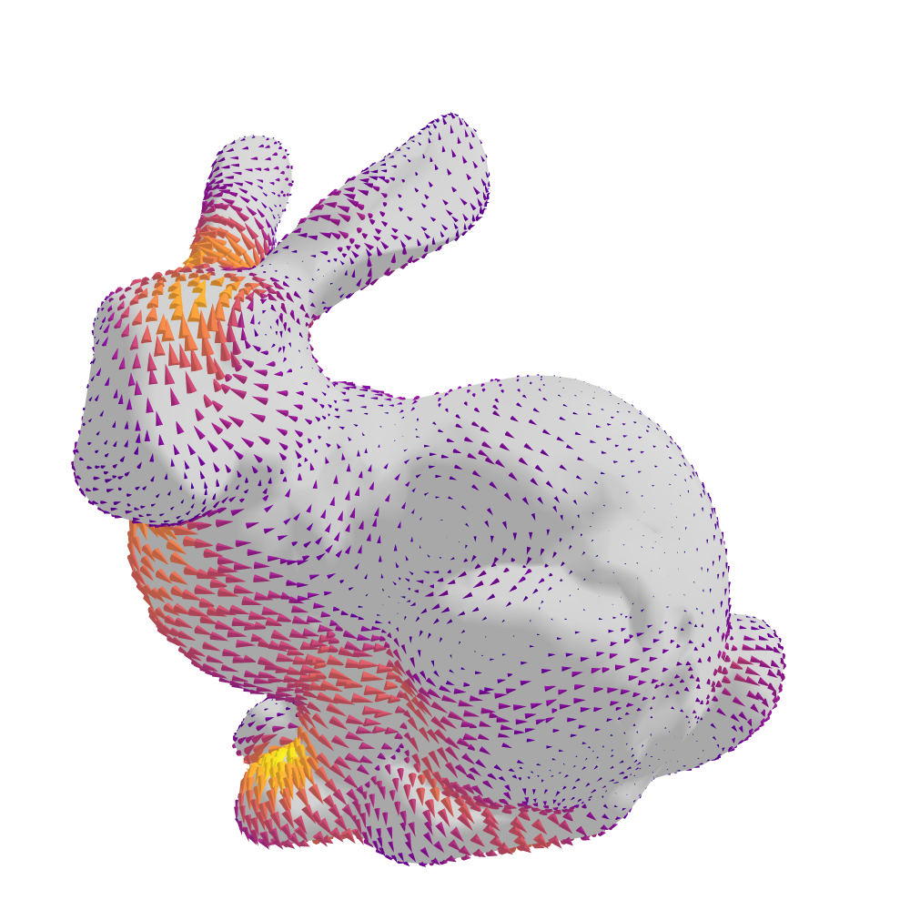

# Discrete Gaussian Vector Fields on Meshes

This repo contains the code required to reproduce the examples in [Discrete Gaussian Vector Fields on Meshes](https://arxiv.org/abs/2507.20024)
by Gillan et al.

## Library Code

The core of the implementation is in 3 python files.

### [eigenbasis.py](eigenbasis.py)

This file provides 2 functions to generate basis fields with respect to a mesh.

### [kernel.py](kernel.py)

This file provides functions to generate Gaussian process kernels using the generated basis functions,
and a helpful function for performing posterior inference.

### [sph_utils.py](sph_utils.py)

This file provides a number of helpful utilities for converting from latitude/longitude grids to Euclidean space.

## Examples

There are 4 Jupyter notebooks in the `notebooks/` directory:

### [Monthly Average High Altitude Wind Fields](notebooks/high-alt-wind-field.ipynb)

This example downscales ERA-5 wind u- and v- outputs at the 550hPa level from 10 degrees to 2 degrees. 

It expects a NetCDF file
in the `data/` directory with global, monthly averaged variable values. The subsampling is performed in the notebook.

### [Hourly High Altitude Wind Fields](notebooks/hourly-high-alt-wind.ipynb)

This example infers a non-stationary $\kappa$ as a function of latitude by inferring Gaussian weights
for a series of radial basis functions, centred at different latitude values. It performs this inference
on a 10 degree grid for u- and v- values at the 850 hPa pressure level.

It expects a NetCDF file in the `data/` directory with hourly wind values, already downscaled to a 10 degree grid.

### [Mesh Examples](notebooks/mesh_fields.ipynb)

This notebook generates some example meshes and samples vector fields on them. For generating the figures
in the paper, we created a subsampled version of the [Standford Bunny](https://graphics.stanford.edu/data/3Dscanrep/) 
using [MeshLab](https://www.meshlab.net/).

### [Ocean Currents](notebooks/ocean-current.ipynb)

This example infers an ocean current field based on observed velocities from drifting ocean buoys (drifters) off the coast of South Africa. 
It enforces boundary conditions on the coastline, ensuring that inferred and simulated posterior fields do not
have flow into the landmass.

It expects a CSV file with drifter longitude, latitude, time, EWCT value, and NSCT value. This can be obtained from the 
[Copernicus Marine Data Store](https://data.marine.copernicus.eu/products).

